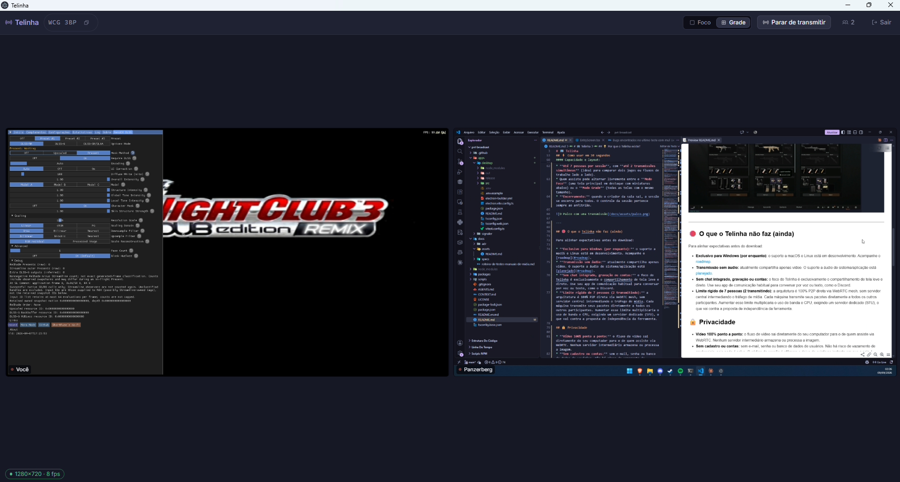

# Telinha

**Screen sharing between friends. Direct, no account, no password.**

You open it, get a six-digit code, paste it in the chat. Whoever shows up, you approve.
When the session ends, everything ends — nothing is left on any server.

## Why this exists

Discord blocked screen sharing in Brazil, and overnight the simplest thing in the world — showing
your screen to four friends — became a problem.

The alternatives want an account. Sign-up, email, password, sometimes a credit card. You create
one more login just to show a screen for twenty minutes, and that login sits there, in a database
that leaks some day. So many have. And most of them route your video through a server on the way,
which means quality drops and, in principle, somebody could be watching.

Telinha does one thing and does it well: **your screen, at good quality, straight onto the machine
of whoever is watching.** No account, no password, no history. The video travels peer to peer.

## Install

Download the installer from the [latest release](https://github.com/hmathsan/scrn-broadcast/releases/latest)
and run it. Windows 10 or 11.

> **Windows will say "Windows protected your PC".**
> That is expected. The installer is not code-signed — a certificate costs a few hundred dollars a
> year, and this project is free and makes no money. Click **More info**, then **Run anyway**. The
> entire source is in this repository if you would like to check it first.

After the first install, updates are silent: they arrive on their own and apply on the next start.

## Using it, in thirty seconds

1. Open Telinha and click **Criar Sessão** (create session). You get a six-digit code, something
   like `K4M 9TX`.
2. Send the code to whoever you want to invite — WhatsApp, Discord, wherever.
3. Each person opens Telinha, types the code and asks to join. **You approve them, one by one.**
4. Click **Transmitir** (broadcast) and pick what to show: a whole monitor, or a single
   application window.

Up to **seven people** per session, with **two broadcasting at once** — enough to show two games
side by side. Whoever is watching chooses between one large screen with thumbnails below, or all
of them the same size in a grid.

When you, the person who created the session, leave, the session ends for everyone. That is
deliberate.

## What it does not do

Worth saying before you download:

- **Windows only.** macOS and Linux are on the roadmap, not in the present.
- **Video, no audio.** Sound still goes through Discord, or wherever you already talk. It is the
  next thing to be built.
- **No chat, no recording, no accounts.** Not an oversight: it is scope. You already have chat.
- **Seven people, two broadcasting.** That is not a timid number — it is the limit of a peer-to-
  peer design where every machine talks directly to every other one. Going beyond it would require
  a video server in the middle, which is exactly what this project does not want to have.

## Privacy, concretely

- **Video never passes through a server.** It is peer-to-peer WebRTC: it leaves your machine and
  arrives at the viewer's.
- **There are no accounts.** Nothing to leak, because nothing is stored. The only secret in the
  system is the session code, and it dies with the session.
- **The signaling server** — the small service that introduces participants to each other at the
  start — **never sees your screen.** It relays negotiation messages and disappears when the
  session ends. It keeps no history and persists nothing.
- The only thing participants learn about each other is an IP address, which is inherent to any
  direct connection.

### About the official signaling server

The signaling server configured in the installer runs on my own Cloudflare account, on the free
plan, and is offered with no guarantees. It handles a few hundred sessions per day; past that it
stops until the next day — it bills nobody, but it also opens no sessions.

If you want a guarantee, **run your own**: [`apps/signaler`](apps/signaler) is a Cloudflare Worker
that fits in the free plan. For now that means rebuilding the app, because the signaling server
address is set at build time — making it configurable is on the roadmap.

## When something goes wrong

**A yellow border around the window being shared.**
Not a bug, and it does not go away. It is Windows telling you the window is being captured;
Telinha uses the API Windows requires in order to capture game windows correctly, and that border
comes with it. On some systems it does not appear at all.

**"Windows protected your PC" during installation.**
Unsigned installer. More info → Run anyway. See the install section.

**The window I picked shows up black or frozen.**
Usually an exclusive-fullscreen game. Switch the game to borderless windowed mode, or share the
whole monitor instead of the window.

**The broadcast stutters, pixelates or looks blurry.**
Open the diagnostics panel in the app and look at the **encoder in use**. If it is a software one
(something like `OpenH264`), your graphics card is not helping and the CPU is doing the encoding
by hand — that is exactly what it looks like. If it is hardware and still bad, the bottleneck is
the network: diagnostics shows packet loss.

On older cards or with a bad driver, hardware acceleration sometimes hurts more than it helps —
green frames, artifacts, a frozen picture. You can turn it off by setting the environment variable
`SCRN_BROADCAST_DISABLE_HW_ACCEL=1` before opening the app; it applies to both sides, sender and
receiver. Leaving acceleration on is almost always better: without it the CPU does all the work
and the machine runs hot.

**"Atualize o aplicativo para entrar nesta Sessão" (update the app to join this session).**
Somebody is on a newer version. Close Telinha and open it again — the update downloads on its own
and applies at startup.

**It will not connect at all.**
Some networks (mobile internet in particular, and certain fiber providers) do not let two machines
find each other directly, and the connection needs a relay. Telinha uses one, but it has a monthly
quota. If that runs out, those networks stop connecting until the month turns over. Diagnostics
shows whether your connection is going through that path.

If none of this helped, [open an issue](https://github.com/hmathsan/scrn-broadcast/issues/new/choose)
and **attach the exported diagnostics** — without it, almost any media problem turns into
guesswork.

## Roadmap

Roughly in order of importance, with no deadlines:

- **Audio in the broadcast.** A game screen without sound is half a solution, and for many people
  it is what decides between using this and not using it.
- **macOS and Linux.**
- **Say on screen when the connection needs a relay and none is available**, instead of simply
  failing to connect.
- **Announce that an update arrived**, instead of applying it silently.
- **Turn hardware acceleration on and off from inside the app**, without an environment variable.
- **Pick the signaling server inside the app**, so running your own does not mean recompiling.
- **A signed installer**, if the number of people ever justifies the cost.
- **More people per session** — under study, and honestly hard: since every machine talks directly
  to every other one, the cost grows fast. Going past seven would require a video server in the
  middle, which changes what this project is.

---

[Português](README.md)

